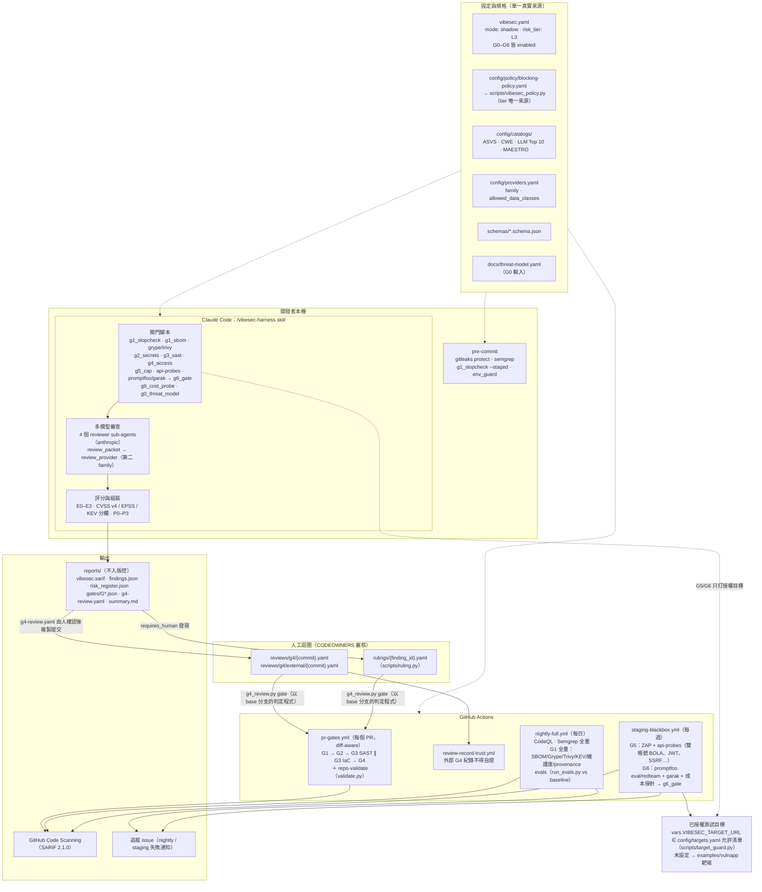
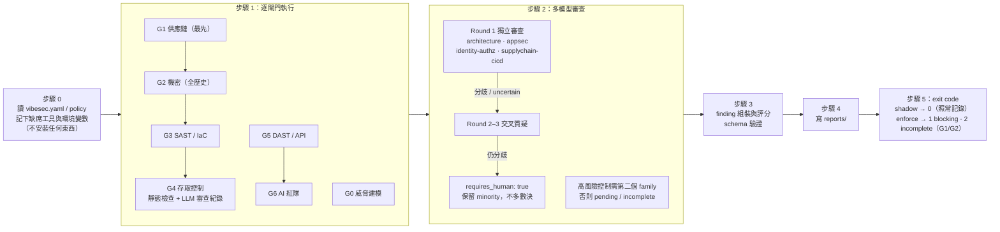

# VibeSec — Vibe Coding 六道資安閘門（G0–G6）測試框架

> 為 Vibe Coding（開發者依賴 AI 產生程式碼並「全部接受」）建立一套**嵌入 CI/CD、不可繞過、白箱＋黑箱＋AI 紅隊**的常態化資安測試管線，並由一個 **harness agent** 把整個流程包起來：執行閘門、彙整發現、多模型審查、證據分級、評分、產出報告。

本 repo 這一版交付的是**框架文件、可直接使用的設定檔、GitHub Actions 工作流、harness agent 的 skill/agent 定義與一個刻意有漏洞的靶場**。確定性判定由 `scripts/` 下的閘門腳本與工作流執行（本機 harness 與 CI 共用同一份程式碼與政策），LLM 審查由 skill 驅動的 agent 執行，裁決一律交人。

## 為什麼需要六道閘門

AI 生成程式碼有四大典型病徵：**幻覺套件（Slopsquatting）**、**硬編碼金鑰**、**靜態注入漏洞（SQLi / XSS / Command）**、**前端防禦假象（BOLA / IDOR）**。Vibe Coding 把「人類撰寫、同儕審查、測試」三道把關壓縮成只剩「測試」，所以測試必須變成 CI/CD 中不可繞過的閘門。

```
[ G0 威脅建模 ] (設計期前置：STRIDE / LINDDUN / MAESTRO，致命三要素檢驗，L1/L2/L3 分級)
       │
       ▼ (每次 Commit / PR —— 白箱，由內而外)
┌────────────────────────────────────────────────────────┐
│ G1 相依性與供應鏈   SCA / Slopsquatting 四層防禦 / SBOM │
│ G2 機密與金鑰       Gitleaks 全歷史 / Push Protection   │
│ G3 SAST 與 IaC      跨檔污點分析 / IMDSv2 / CORS        │
│ G4 架構與存取控制   BOLA / RLS / Agent Tool 權限 / HITL │
└────────────────────────────────────────────────────────┘
       │
       ▼ (部署至 Staging / 上線前 —— 黑箱，由外而內)
┌────────────────────────────────────────────────────────┐
│ G5 DAST 與 API      雙帳號 BOLA 實測 / JWT / SSRF / 設定外溢 │
│ G6 LLM / Agent 紅隊 Prompt Injection / 二次 XSS / Denial of Wallet │
└────────────────────────────────────────────────────────┘
       │
       ▼
[ harness agent ] 彙整 → 多模型審查 → E0–E3 證據分級 → CVSS/EPSS/KEV → P0–P3 → SARIF + findings.json + risk_register.json + summary.md
```

## 系統架構與流程（Architecture Overview）

### 整體架構

四個執行入口（本機 pre-commit、`/vibesec-harness`、三條 CI 工作流、審查紀錄信任檢查）共用同一套設定與判定程式；tier 一律由 `scripts/vibesec_policy.py` 從 blocking policy 計算，各閘門腳本不自行寫死。



### harness 執行流程（`/vibesec-harness`）



閘門狀態為 `pass` / `fail` / `incomplete` / `pending` / `untested` / `not_applicable`（`schemas/gate-result.schema.json`）：工具缺席、逾時、缺金鑰、資料分級不允許送出 → `incomplete` 或 `pending`，絕不視為通過。`mode: shadow` 與 `enforce` 執行完全相同的閘門與審查，差別只在 exit code（docs/08 §5）。

## 快速上手

1. 複製 `docs/templates/threat-model.yaml` 填寫 G0，決定 `risk_tier`（L1 / L2 / L3）並寫入 `vibesec.yaml`。
2. 把 `.github/workflows/` 三條工作流、`.pre-commit-config.yaml`、`config/` 複製到目標專案；在 repo 的 Actions variables 設定已授權測試目標 `VIBESEC_TARGET_URL`（未設定則只打內建靶場），在 secrets 設定 `VIBESEC_TOKEN_A`、`VIBESEC_TOKEN_B` 與模型金鑰（見 `config/providers.yaml`）。
3. 在 Claude Code 中執行 `/vibesec-harness`：harness agent 會依 `vibesec.yaml` 執行閘門、呼叫四個 reviewer sub-agent，並把報告寫到 `reports/`。
4. 試點期維持 `mode: shadow`（只報告）；驗收後改 `mode: enforce`，命中 `config/policy/blocking-policy.yaml` 的發現即擋 PR。
5. 要驗證黑箱閘門，先啟動靶場：`uv run --project examples/vulnapp uvicorn app.main:app --port 8000`。

## 目錄導覽

| 路徑 | 內容 |
|---|---|
| `vibesec.yaml` | 主設定：模式、風險分級、各閘門參數、審查與評分規則 |
| `docs/00-overview.md` | 四大病徵 → G0–G6 映射、雙軌架構、三大工程原則、責任歸屬 |
| `docs/01`–`07` | G0 威脅建模、G1 供應鏈、G2 機密、G3 SAST/IaC、G4 存取控制與 Agent 審查、G5 DAST/API、G6 AI 紅隊 |
| `docs/08-harness-agent.md` | harness 狀態機、閘門順序、模式、exit code、incomplete 語意 |
| `docs/09-multi-model-review.md` | provider 抽象、四個審查角色、輪次規則、少數意見、人工裁決 |
| `docs/10-evidence-scoring-and-findings.md` | E0–E3、validation_status、CVSS v4 / EPSS / KEV、P0–P3 SLA、finding JSON |
| `docs/11-tool-selection-matrix.md` | SAST / SCA / DAST / AI 紅隊工具比較與 L1/L2/L3 組合 |
| `docs/12-pilot-and-evaluation.md` | 四週試點、60+ 案例、三組比較、驗收門檻 |
| `docs/13-roadmap-governance-compliance.md` | 12 個月路線圖、ASVS 5.0 / NIST AI RMF / EU CRA / CSL-PIPL 對齊、MAESTRO 對接 |
| `docs/templates/` | G0 威脅模型模板、G0 報告模板、finding 與 risk register 範例 |
| `schemas/` | `finding`、`gate-result`、`threat-model` JSON Schema |
| `config/` | 各工具可直接使用的設定：Semgrep 規則、gitleaks、Checkov、slopsquat 清單、ZAP、promptfoo、garak、blocking 政策、catalogs、providers、harness 角色提示 |
| `.claude/skills/vibesec-harness/` | `/vibesec-harness` skill：harness agent 的操作流程 |
| `.claude/agents/` | 四個 reviewer sub-agent：architecture、appsec、identity、supplychain |
| `.github/workflows/` | `pr-gates.yml`（G1–G4 diff-aware）、`nightly-full.yml`（CodeQL + 全量 + evals）、`staging-blackbox.yml`（G5 + G6 打靶場）、`review-record-trust.yml`（外部 G4 紀錄不得自證） |
| `examples/vulnapp/` | 刻意有漏洞的 FastAPI 靶場（BOLA、JWT alg:none、SSRF、Prompt Injection、Stored XSS、Denial of Wallet） |
| `evals/` | 評測案例格式與種子案例（正例 / 反例、held_out） |
| `scripts/` | 各閘門的判定程式（`g0_*`–`g6_*`）、多模型審查（`review_packet.py`、`review_provider.py`）、人工裁決（`ruling.py`）、評測（`run_evals.py`）、政策查詢（`vibesec_policy.py`）與自我驗證（`validate.py`） |
| `reviews/`、`rulings/` | 人確認後提交的 G4 LLM 審查紀錄與人工裁決（harness、模型、bot 不得寫入） |

## 目錄結構

```text
MultiAgentDelta/
├── CLAUDE.md                      # AI 協作者規範（不可違反的規則、命名慣例）
├── README.md
├── vibesec.yaml                   # 主設定：mode、risk_tier、G0–G6 參數、審查與評分規則
├── .pre-commit-config.yaml        # 本機：gitleaks / semgrep / g1_slopcheck / env_guard
├── .semgrepignore
├── .claude/
│   ├── settings.json              # Claude Code 權限（危險操作列為 ask / deny）
│   ├── skills/vibesec-harness/
│   │   └── SKILL.md               # /vibesec-harness：步驟 0–5 操作流程
│   └── agents/                    # 4 個 reviewer sub-agents
│       ├── vibesec-architecture.md
│       ├── vibesec-appsec.md
│       ├── vibesec-identity.md
│       └── vibesec-supplychain.md
├── .github/
│   ├── CODEOWNERS                 # reviews/、rulings/、政策檔需指定審核者
│   ├── dependabot.yml
│   ├── scripts/                   # 失敗通知開 issue（nightly-issue.js、staging-issue.js + 測試）
│   └── workflows/
│       ├── pr-gates.yml           # PR：G1 → G2 → G3（SAST ∥ IaC）→ G4，repo-validate
│       ├── nightly-full.yml       # 每日：CodeQL、Semgrep 全量、G1 全量、evals、notify
│       ├── staging-blackbox.yml   # 每週：G5 DAST/API + G6 AI 紅隊、notify
│       └── review-record-trust.yml# 外部 G4 紀錄須由非作者 approve
├── config/
│   ├── catalogs/                  # ID 唯一來源：ASVS 5.0、CWE 對應、LLM Top 10 2025、MAESTRO
│   ├── policy/blocking-policy.yaml# blocking 清單、tier_overrides、exceptions（人類獨立 PR 才能改）
│   ├── providers.yaml             # 模型 provider：family、allowed_data_classes、金鑰環境變數
│   ├── targets.yaml               # G5/G6 授權目標允許清單（預設只允許本機靶場；CLAUDE.md 規則 8）
│   ├── harness/                   # harness 系統提示與 4 個角色 prompt（sub-agent 與外部 provider 共用）
│   ├── slopsquat/                 # G1：allowlist、blacklist、冷卻期、popular npm/PyPI 清單
│   ├── gitleaks.toml              # G2
│   ├── semgrep/vibesec-rules.yaml # G3 自訂規則
│   ├── checkov/                   # G3 IaC：設定與自訂檢查（IMDSv2、CORS 萬用字元）
│   ├── zap/                       # G5：API scan 設定、雙帳號 context
│   ├── promptfoo/                 # G6：決定性測試與 redteam 設定
│   └── garak/                     # G6：探針設定
├── scripts/
│   ├── vibesec_policy.py          # tier 唯一計算來源
│   ├── g0_threat_model.py         # G0：schema、致命三要素、risk_tier 推導
│   ├── g0_trifecta.py
│   ├── g1_slopcheck.py            # G1：四層 Slopsquatting 防禦
│   ├── g1_sbom.py                 # G1：CycloneDX SBOM 產生、可重現性與完整性
│   ├── g1_kev.py                  # G1：Grype 結果 × CISA KEV
│   ├── g1_maintenance.py          # G1：deps.dev 維護度 / deprecated
│   ├── g1_provenance.py           # G1：SBOM 的 SLSA provenance 驗證
│   ├── g2_secrets.py              # G2：gitleaks 全歷史 + .env 防護
│   ├── env_guard.py
│   ├── g3_sast.py                 # G3：semgrep + checkov + trivy config
│   ├── sarif_gate.py              # SARIF → gate JSON（G2、G3 共用）
│   ├── g4_access.py               # G4：靜態檢查 + LLM 審查紀錄
│   ├── g4_review.py               # G4：紀錄驗證、閘門推導、外部紀錄信任檢查
│   ├── g5_zap.py                  # G5：ZAP 警示 → 覆蓋與 SARIF（併入 api-probes）
│   ├── g6_gate.py                 # G6：promptfoo / garak / 成本探針結果彙整
│   ├── g6_cost_probe.py           # G6：成本面（Denial of Wallet）探針，只記狀態碼與耗時
│   ├── target_guard.py            # G5/G6：攻擊性探針只對 config/targets.yaml 允許的目標執行
│   ├── review_packet.py           # 審查包：附上受測程式碼（祕密遮罩、大小上限）
│   ├── review_provider.py         # 呼叫第二個 family 的模型（資料分級把關）
│   ├── ruling.py                  # 人工裁決：request / check / apply
│   ├── run_evals.py               # 評測：召回率 / 精確率，對照 baseline
│   └── validate.py                # 本 repo 自我驗證
├── schemas/                       # finding、gate-result、threat-model、g4-review、human-ruling
├── docs/
│   ├── 00-overview.md … 13-roadmap-governance-compliance.md
│   ├── threat-model.yaml          # 本 repo 的真實威脅模型（G0 輸入）
│   └── templates/                 # 威脅模型、G0 報告、finding、risk register、g4-review、裁決範例
├── evals/
│   ├── README.md
│   ├── baseline.yaml              # 評測基準線（nightly 對照）
│   ├── split.yaml                 # 案例切分（含 held_out）
│   └── cases/g0 … g6/             # 正例 / 反例 / incomplete 案例
├── examples/vulnapp/              # 刻意有漏洞的 FastAPI 靶場（只能打靶場）
│   ├── app/{main.py,llm_stub.py}
│   ├── seed_users.json
│   └── pyproject.toml, uv.lock
├── reviews/g4/                    # 人提交的 G4 審查紀錄：<commit>.yaml、external/<commit>.yaml
├── rulings/                       # 人工裁決：<finding_id>.yaml
└── reports/                       # 執行期產物（.gitignore，不入版控）
    ├── raw/G0 … G6/               # 各工具原生輸出
    ├── gates/G*.json
    ├── vibesec.sarif · findings.json · risk_register.json
    ├── g4-review.yaml
    └── summary.md
```

## 三大落地工程原則

1. **分層阻擋（Blocking vs Advisory）**：高確定性發現（硬編碼金鑰、幻覺或冷卻期未滿套件、未參數化 SQL、JWT alg:none、雙帳號 BOLA 實證、KEV 命中）為 blocking；需人工判斷的架構建議為 advisory。
2. **輸出標準化（SARIF）**：所有工具輸出統一為 SARIF 2.1.0 上傳 GitHub Code Scanning，並對照 CWE；架構類發現進 risk register。
3. **差異感知（Diff-Aware）**：PR 階段只掃變更；夜間全量補齊。

## 來源與對齊

OWASP ASVS 5.0.0（L2 預設基線、L3 高價值系統）、OWASP LLM Top 10 2025、CSA MAESTRO 七層威脅模型、NIST AI RMF 1.0、EU CRA、FIRST CVSS v4.0 / EPSS、CISA KEV。
