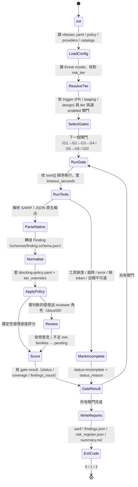

# 08 — Harness Agent：把整條管線包起來的執行者

> 本文件定義 harness agent 的職責、輸入、狀態機、閘門順序、模式語意、`incomplete ≠ pass` 規則、exit code 與報告產物。它同時是 `.claude/skills/vibesec-harness/SKILL.md`、`config/harness/harness-agent.md` 與未來 Python CLI `vibesec run` 的規格。多模型審查細節見 `docs/09-multi-model-review.md`；證據分級與評分見 `docs/10-evidence-scoring-and-findings.md`。

## 1. 目的

Vibe Coding 把「人類撰寫、同儕審查、測試」壓縮成只剩「測試」。harness agent 的工作不是「再多一個 AI 看一眼」，而是**確保 G0–G6 每一道閘門都被確定性地執行、結果被統一格式記錄、沒跑到的部分被誠實標為未完成**，然後才把需要判斷的部分交給多模型審查與人工裁決。

harness agent 做五件事，順序固定：

1. **執行閘門**：依 `vibesec.yaml` 的 `gates.*` 逐一呼叫工具，套用 timeout 與 diff 範圍。
2. **彙整發現**：把 SARIF / JSON 原生輸出正規化為 `schemas/finding.schema.json` 的 Finding。
3. **多模型審查**：對需要判斷的發現呼叫四個 reviewer 角色（`review.roles`），依輪次規則記錄意見。
4. **證據分級與評分**：E0–E3、validation_status、CVSS v4.0 / EPSS / KEV 分欄、P0–P3。
5. **產出報告與 exit code**：`output.*` 四個檔案，並依 `mode` 與 blocking 政策決定 0 / 1 / 2。

harness agent **不做**的事：不寫修補程式碼、不改任何設定讓檢查通過、不跳過閘門、不猜 ID、不把模型信心當證據（見 §10）。

## 2. 輸入

| 輸入 | 來源 | 缺席時的處置 |
|---|---|---|
| 主設定 | `vibesec.yaml`（`mode`、`risk_tier`、`project.*`、`gates.*`、`review.*`、`scoring.*`、`output.*`） | 無法啟動；整次執行 exit 2 並寫 `summary.md` 說明 |
| 阻擋政策 | `policy_file` → `config/policy/blocking-policy.yaml` | 無法啟動（政策缺席不等於全部 advisory） |
| Provider 設定 | `providers_file` → `config/providers.yaml` | 審查階段全部 `incomplete`；確定性閘門照跑 |
| 目錄 | `catalogs_dir` → `config/catalogs/` | 所有 `control_id` / `cwe` 填 `null` 並在 `notes` 說明；審查結論不得引用 ID |
| 威脅模型 | `project.threat_model`（符合 `schemas/threat-model.schema.json`） | G0 `incomplete`，`status_reason: "threat model file missing"`；`risk_tier` 退回 `vibesec.yaml` 所寫值並在報告標註「未經 G0 核對」 |
| Git diff base | 參數 `--diff <base>`；CI 中為 `github.event.pull_request.base.sha` | `diff_aware: true` 的閘門退為 `scope: full`，並在 gate result 記 `diff_base: null` |
| 靶場 URL | 環境變數 `VIBESEC_TARGET_URL`（`gates.g5_dast_api.target_url_env`）；CI 中來自 repo Actions 變數 `vars.VIBESEC_TARGET_URL`，不接受手動觸發輸入 | G5、G6 `incomplete`，`status_reason: "VIBESEC_TARGET_URL not set"` |
| 雙帳號 Token | `VIBESEC_TOKEN_A`、`VIBESEC_TOKEN_B` | G5 的 `bola_idor` 控制 `untested`，G5 整體 `incomplete`（`two_account_test: required`） |
| 模型金鑰 | `config/providers.yaml` 各 provider 的 `api_key_env` | 該 provider 不可用；若導致高風險控制不足兩個 family → 相關發現 `pending`、閘門 `incomplete` |

## 3. 狀態機



| 狀態 | 做什麼 | 失敗時 |
|---|---|---|
| Init | 建立 `reports/`、記錄 commit、時間、執行者（Claude Code / Actions / CLI） | 無法建立目錄 → exit 2 |
| LoadConfig | 讀四個設定檔，驗證 YAML 與 schema | 任一主設定缺席或不合法 → exit 2，不跑任何閘門 |
| ResolveTier | 讀 `project.threat_model`，比對 `risk_tier`；不一致以威脅模型為準並記錄 | 檔案缺席 → G0 `incomplete`，繼續 |
| SelectGates | 依事件挑閘門：PR 事件 → G1–G4；staging 事件 → G5、G6；design 事件 → G0。L1 只保留 G1、G2 | 無任何閘門 enabled → summary 標示並 exit 0（shadow）或 2（enforce） |
| RunTools | 每個工具一個子程序，`timeout_seconds` 為閘門總預算；逐一記錄 `name / version / state / exit_code / output_ref / duration_seconds` | 見 §7 |
| ParseNative | SARIF 2.1.0 取 `runs[].results[]` 與 `tool.driver.rules[]`；JSON（grype、trivy、gitleaks、zap、promptfoo、garak）各自的 adapter | 解析失敗 → 該工具 `state: error`，閘門 `incomplete` |
| Normalise | 產生 `id`（`VS-YYYYMMDD-<8 hex>`，hex 取 `sha256(rule_id + path + line + commit)` 前 8 碼）、`rule_id` 前綴、`location`、`evidence_refs`、`sources` | 欄位缺失以 `null` 補，不得省略 |
| ApplyPolicy | 查 `blocking:` / `advisory:` / `tier_overrides.<tier>` / `exceptions:` 決定 `policy_tier` | 規則不在任何清單 → `default_tier` |
| Review | 僅對 `llm_review: true` 的閘門（G4）與 E1 / E2 且 policy_tier 為 blocking 或 P0 / P1 候選的發現送審 | provider 失敗 → 意見缺席，見 docs/09 §9 |
| Score | 依 docs/10：CVSS v4.0 向量（工具提供或 reviewer 提議、人工確認後才填）、EPSS / KEV 查詢、E 等級、P 優先序 | 查詢 API 失敗 → `epss: null`、`kev: null`，`notes` 記原因；不影響閘門狀態 |
| GateResult | 寫 `reports/gates/G<N>.json`（符合 `schemas/gate-result.schema.json`） | — |
| WriteReports | 合併寫出 `output.*` 四個檔案 | — |
| ExitCode | 見 §8 | — |

## 4. 閘門順序與理由

PR 事件固定順序 **G1 → G2 → G3 → G4**；staging 事件 **G5 → G6**；design 事件 **G0** 單獨跑。

- **G1 必須最先跑**（`gates.g1_supply_chain.order: first`）：惡意套件的 `postinstall`（Node）或 `setup.py`（Python）會在**安裝瞬間**執行。Nx s1ngularity 與 Shai-Hulud 蠕蟲就是在 postinstall 呼叫本機 Claude / Gemini CLI 刮憑證。若先跑 G3 的 Semgrep 或先 `npm ci` 以便測試，等於先讓惡意程式跑過一遍再來掃它。因此 G1 的四層檢查（Registry 健康度、名稱相似度、安裝 Hook 靜態檢查、冷卻期）要在**任何會觸發安裝的步驟之前**完成；harness 在 G1 通過前不得執行 `npm install`、`pip install`、`uv sync`。
- **G2 第二**：全 Git 歷史祕密掃描不依賴安裝，且一旦命中要先撤銷憑證，越早知道越好。
- **G3 第三**：SAST / IaC 需要原始碼，不需安裝；污點分析較耗時。
- **G4 最後**：靜態存取控制檢查加 LLM 審查，依賴 G3 的結果（例如已知的 sink）做輸入。
- **G5 → G6**：兩者都打靶場；G5 先確認目標可達、取得雙帳號 session，G6 的 Stored XSS via AI Output 也會用到 G5 建立的帳號。
- **G0** 由 `trigger: [design, major_change, agent_introduction]` 觸發，不在 PR 管線的關鍵路徑上，但其產物（威脅模型）是 ResolveTier 的輸入。

harness **不得**因 `tools[]` 中第一個工具缺席就跳到下一個閘門：要依序嘗試清單中的所有工具（例如 G1 的 `syft, grype, trivy`），全數缺席才記 `incomplete`。

## 5. 模式：shadow 與 enforce

| | `mode: shadow` | `mode: enforce` |
|---|---|---|
| 目的 | 試點期只報告 | 驗收後正式阻擋 |
| blocking 發現 | 照常記錄為 `policy_tier: blocking`，但 exit 0 | exit 1 |
| blocking 閘門 `incomplete` | 記錄，exit 0 | 若該閘門列在 `incomplete_gate_is_blocking_in_enforce`（預設 G1、G2）→ exit 2 |
| 報告 | 完整產出，`summary.md` 標題註明 `[SHADOW]` | 完整產出 |
| SARIF 上傳 | 照常（`output.upload_code_scanning: true`） | 照常 |

shadow 的意思是「不擋」，不是「少做」。shadow 與 enforce 執行**完全相同**的閘門、工具、審查與評分；差別只在最後的 exit code。試點期的召回率 / 精確率數據（`docs/12-pilot-and-evaluation.md`）必須來自 shadow 模式的完整輸出。

模式只能由 `vibesec.yaml` 的 `mode` 或 CLI `--mode` 參數決定；harness agent 不得自行改寫。`--mode` 只能把 shadow 升為 enforce（例如在 staging 工作流強制），**不得**把 enforce 降為 shadow。

## 6. Diff-aware 與 full

- `diff_aware: true` 的閘門（G1、G3、G4）在 PR 事件只處理 `git diff --name-only <base>...HEAD` 的檔案；G1 另外比對 lockfile 的新增 / 升版項目。
- `diff_aware: false` 的閘門（G2）永遠全量：祕密可能在舊 commit。
- G5、G6 沒有 diff 概念，永遠對目標全量。
- 夜間工作流（`.github/workflows/nightly-full.yml`）把所有閘門以 `scope: full` 重跑，並加上 `g3_sast_iac.nightly_full: [codeql]`。
- gate result 必須記錄 `scope` 與 `diff_base`；PR 階段 `scope: diff` 的「pass」只代表「變更部分通過」，`summary.md` 要寫明。

## 7. Timeout 與 `incomplete ≠ pass`

每個閘門有 `timeout_seconds`，為該閘門所有工具的總預算。單一工具逾時 → 該工具 `state: timeout`；若閘門內還有工具可補足同一控制則繼續，否則閘門 `incomplete`。

**規則**：任何導致「本來要檢查的東西沒有被檢查」的情況，一律 `status: incomplete` 並填 `status_reason`。絕不產生 `pass`。`coverage[]` 內受影響的控制標 `untested` 或 `pending`，不得標 `pass`。

| 情境 | 工具 `state` | 閘門 `status` | `status_reason` 範例 | 備註 |
|---|---|---|---|---|
| 工具二進位缺席（`which gitleaks` 失敗） | `missing` | `incomplete` | `gitleaks binary not found in PATH` | 清單中所有工具都缺席才算；部分缺席要在 `tools[]` 逐一記錄 |
| 工具逾時 | `timeout` | `incomplete` | `semgrep exceeded 900s on 1,240 files` | 記錄已完成的部分輸出，但不據此宣稱 pass |
| 外部 API 失敗（npm registry、OSV、EPSS、KEV） | `error` | G1 `incomplete` | `registry.npmjs.org returned 503 for 3/12 packages` | EPSS / KEV 失敗只影響欄位（填 `null`），不影響閘門狀態；Registry 健康度查不到則影響 G1 狀態 |
| 缺 Token（`VIBESEC_TOKEN_B` 未設） | `api-probes: error` | G5 `incomplete` | `two_account_test required but VIBESEC_TOKEN_B unset` | `bola_idor` 控制 `untested`；其他 G5 檢查可照跑但閘門整體仍 `incomplete` |
| 目標不可達（`VIBESEC_TARGET_URL` 連線逾時或 5xx） | `zap-baseline: error` | G5 / G6 `incomplete` | `GET https://staging.example/healthz timed out after 30s` | 不得把「目標沒回應」當成「沒有漏洞」 |
| 威脅模型缺席 | — | G0 `incomplete` | `docs/templates/threat-model.yaml not found` | 其他閘門照跑；`risk_tier` 標「未核對」 |
| Provider 全部不可用 | — | G4 `incomplete`；其他閘門中需審查的發現 `validation_status: pending` | `no provider reachable; 0/2 families for high-risk controls` | 確定性發現不受影響 |
| 靶場啟動失敗（本地 `uvicorn` 起不來） | — | G5 / G6 `incomplete` | `target failed to start: port 8000 refused` | — |
| Catalogs 缺席 | — | 各閘門照跑，但所有 `control_id` / `cwe` 為 `null` | 在 `notes` 記 `catalogs_dir missing` | 不算 `incomplete`，但 coverage 全為 `pending`（無法對應控制） |

`not_applicable` 只用於**依設計本來就不適用**的情況，且必須有 `status_reason`：例如 `project.contains_llm: false` → G6 `not_applicable`，`status_reason: "project.contains_llm is false"`；專案不使用 GitHub → G1 的 GitHub Actions 控制 `not_applicable`，理由寫明實際 CI 平台。「沒跑」永遠不是 `not_applicable`。

## 8. Exit code

依 `schemas/gate-result.schema.json`：

| exit | 條件 | 說明 |
|---|---|---|
| `0` | `mode: shadow`；或 `mode: enforce` 且無 blocking 發現、無 blocking 閘門 incomplete | 通過或影子模式 |
| `1` | `mode: enforce` 且至少一個 `policy_tier: blocking` 的發現 `validation_status != refuted` | 阻擋 PR / 部署 |
| `2` | `mode: enforce` 且 `incomplete_gate_is_blocking_in_enforce` 內的閘門 `incomplete`；或主設定無法載入 | 「不知道」也要擋。這是 incomplete ≠ pass 的 CI 落地 |

優先序：若同時有 blocking 發現與 blocking 閘門 incomplete，回 `1`（有確定的壞消息優先於不確定），但 `summary.md` 必須同時列出兩者。整體 exit code 為所有閘門 exit code 的最大值（`1` 與 `2` 同時存在時取 `1`，見上）。

## 9. 報告產物

全部寫入 `reports_dir`（預設 `reports/`）：

| 檔案 | 內容 | 消費者 |
|---|---|---|
| `reports/vibesec.sarif` | SARIF 2.1.0，只含 `location.kind` 為 `code / dependency / config` 的發現；每個 run 對應一個工具；`rule.id` 為 `rule_id`，`properties` 帶 vibesec 欄位（對映表見 docs/10 §8） | GitHub Code Scanning |
| `reports/findings.json` | `{ "findings": [Finding...] }`，全部發現，含 `review.opinions[]` | 人工分流、evals、儀表板 |
| `reports/risk_register.json` | `location.kind: architecture` 與 `prompt` 的發現，加上 G0 的 open threats | AppSec / 治理 |
| `reports/gates/G<N>.json` | 每道閘門一個 gate result | CI、coverage 計算 |
| `reports/summary.md` | 人看的摘要 | PR comment、Slack |
| `reports/raw/<gate>/<tool>.*` | 工具原生輸出；`evidence_refs[].ref` 指向這裡 | 稽核、重現 |

### summary.md 固定版面

```markdown
# VibeSec Summary — <project.name> @ <commit 7 碼>  [SHADOW|ENFORCE]  tier <L1|L2|L3>

## 1. 閘門狀態矩陣
| Gate | Status | Scope | Tools (ran/missing/timeout/error) | Blocking | Advisory | Coverage |
| G1 | pass | diff | syft ✓ grype ✓ trivy ✓ | 0 | 3 | 6/6 |
| G2 | fail | full | gitleaks ✓ | 1 | 0 | 2/2 |
| G5 | incomplete | full | zap-baseline ✗(missing) api-probes ✗(error) | – | – | 0/8 |

## 2. INCOMPLETE（未完成，不等於通過）
> ⚠ G5: two_account_test required but VIBESEC_TOKEN_B unset
> ⚠ G0: threat model file missing — risk_tier L2 未經核對

## 3. 致命三要素（G0）
agent `support-bot`: private_data ✓ / untrusted_content ✓ / external_comms ✓ → **三要素成立**，leg_cut: egress_allowlist（已緩解）

## 4. 發現（依 priority 排序）
| ID | Gate | Rule | Priority | Tier | E | Status | Location |

## 5. 控制覆蓋率
已完成測試 / 適用控制 = 18 / 27 = 66.7%（pass 15、fail 3、pending 4、untested 5、not_applicable 2）

## 6. 需人工裁決（requires_human）
| ID | 分歧 | 少數方 | 裁決狀態 |
每列附 `python3 scripts/ruling.py request <id>` 的指令；裁決格式與規則見 docs/09 §12。

## 7. Exit code: 1 — enforce 且 G2 有 1 件 blocking
```

INCOMPLETE 區塊永遠出現；沒有 incomplete 時寫「無」。

## 10. 三種執行情境

### (a) Claude Code — `/vibesec-harness` skill

`.claude/skills/vibesec-harness/SKILL.md` 驅動。agent 用 Bash 執行確定性工具，用 Agent tool 呼叫 `.claude/agents/vibesec-*.md` 四個 reviewer sub-agent（第一輪各自獨立呼叫、不共享上下文；交叉輪把其他角色的 rationale 當輸入再呼叫）。語法：

```
/vibesec-harness [--gate g1,g2] [--mode shadow|enforce] [--diff <base>] [--target-url <url>]
```

適用：開發者本機、PR 前自檢、G4 的 LLM 審查、人工裁決前的整理。限制：sub-agent 都是同一個 family（anthropic），因此**在 Claude Code 內跑的審查只滿足一個 family**；高風險控制仍需透過 `config/providers.yaml` 的其他 family 補第二個意見，否則維持 `pending`。

### (b) GitHub Actions

三條工作流：`pr-gates.yml`（G1–G4，diff-aware）、`nightly-full.yml`（CodeQL + 全量）、`staging-blackbox.yml`（G5 + G6）。Actions 內**只跑確定性工具**，不呼叫 LLM；把 SARIF 上傳 Code Scanning、把 `findings.json` 與 gate results 當 artifact 保留。LLM 審查由 (a) 或 (c) 讀取 artifact 後執行。Actions 自身也是被審對象：第三方 Action 必須固定完整 SHA、`permissions:` 最小化、`pull_request_target` 需追查完整路徑（docs/09 §7）。

### (c) 未來 Python CLI（僅規格）

```
vibesec run --gate g1 --mode shadow --diff origin/main
vibesec run --gate g5,g6 --target-url $VIBESEC_TARGET_URL
vibesec review --findings reports/findings.json --roles appsec,identity-authz
vibesec report --format summary|sarif
```

CLI 讀同一份 `vibesec.yaml`，實作同一個狀態機，透過 `config/providers.yaml` 的統一 `complete()` 介面呼叫多家 provider。本 repo 的文件與 schema 即其驗收標準。

## 11. 禁止行為（摘自 CLAUDE.md，harness 必須遵守）

1. 不得停用、跳過、放寬 `enabled: true` 的閘門；不得修改 `blocking-policy.yaml` 把 blocking 降為 advisory。
2. 工具缺席 / 逾時 / API 失敗 / 缺帳號 / 缺文件 / 環境無法啟動 → `incomplete`，絕不 `pass`。
3. CWE / CVE / ASVS / LLM Top 10 ID 只能查 `config/catalogs/`；查不到填 `null`。
4. CVSS、EPSS、KEV 分欄記錄；不做 `CVSS × EPSS × 信心` 乘法；模型信心不轉成 E 等級。
5. `evidence_grade` 與 `validation_status` 分開；兩者都不是嚴重度。
6. 高風險控制至少兩個 family；第一輪不交換；最多兩輪交叉；保留少數意見；不多數決；分歧 `requires_human: true`。
7. 資料不出境：見 §12。報告中的祕密只保留遮罩（前 4 後 4）與 sha256 指紋。
8. G5 / G6 探針只打 `VIBESEC_TARGET_URL` 指向的授權環境；harness 必須在發送任何請求前確認該 URL 不在正式環境網域清單內。

## 12. 資料駐留規則

每個 provider 在 `config/providers.yaml` 宣告 `allowed_data_classes`（`public / internal / confidential / pii`）。harness 送審前要替每個發現決定資料分級：

- 取 `location.path` 對應元件在威脅模型 `assets[].sensitivity` 的最高等級；無威脅模型時一律視為 `confidential`。
- 程式碼片段本身預設 `internal`；含祕密（即使已遮罩）、個資樣本、客戶資料 → `confidential` 或 `pii`。
- 只有 `allowed_data_classes` 包含該等級的 provider 才可收到該內容。雲端 provider（anthropic、openai、glm、deepseek）預設不收 `confidential` / `pii`；這類內容只送 `onprem_vllm` 之類的地端 provider。
- 若沒有任何可用 provider 符合分級 → 該發現 `pending`、`notes` 記 `no provider allowed for data_class=pii`，閘門對該控制 `incomplete`。harness **不得**為了湊足兩個 family 而降級資料分類或改送不被允許的 provider。
- 中國廠區（CSL / DSL / PIPL）專案：`providers.yaml` 只啟用地端 provider，並且報告只傳去識別化統計（見 `docs/13-roadmap-governance-compliance.md`）。
